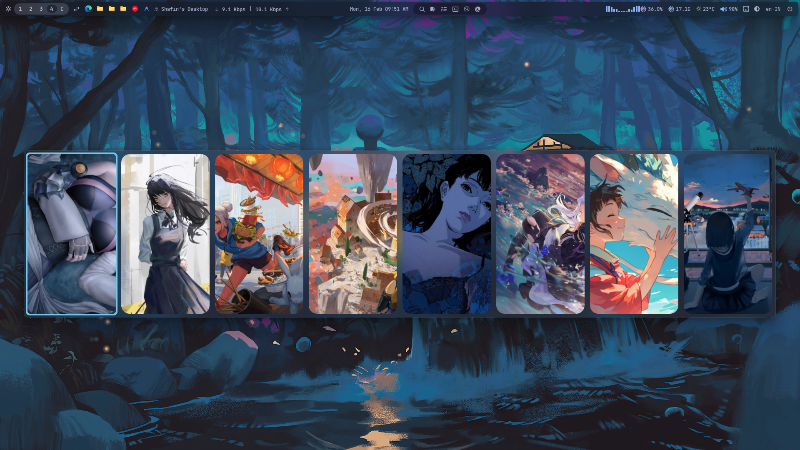

# Windows Configuration Files

This repository contains my personal configuration files for various tools and window managers on Windows.

## Included Configurations

### [GlazeWM](./glazewm)
A tiling window manager for Windows inspired by i3.
- `config.yaml`: Main configuration for keybindings, gaps, and rules.

### [Komorebi](./komorebi)
A tiling window manager for Windows with deep customization.
- `komorebi.json`: Core settings and layout configurations.
- `whkdrc`: Keybinding configurations via `whkd`.

### [Neovim (nvim)](./nvim)
Modern text editor configuration.
- `init.lua`: Neovim startup and plugin configuration.

### [YASB (Yet Another Status Bar)](./yasb)
A highly customizable status bar for Windows.
- `config.yaml`: Bar layout and widget settings.
- `styles.css`: Custom CSS for styling the bar.

---

Made with ❤️ by [Shafin](https://github.com/beingshafin)

